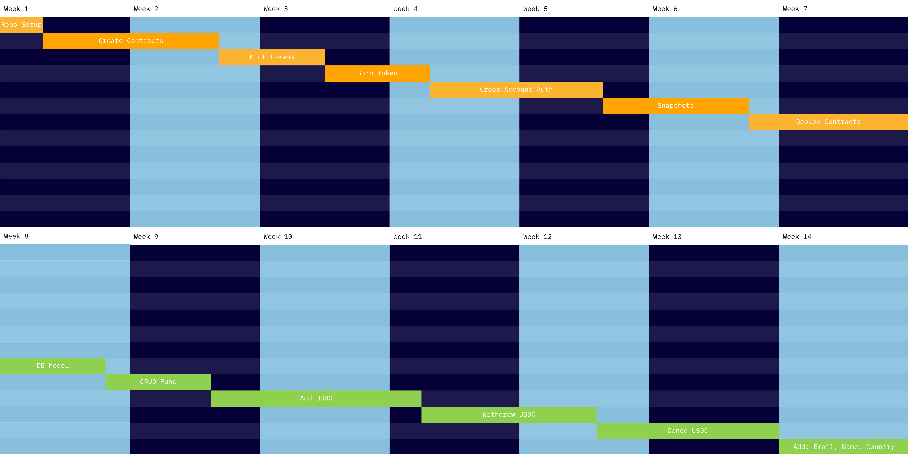
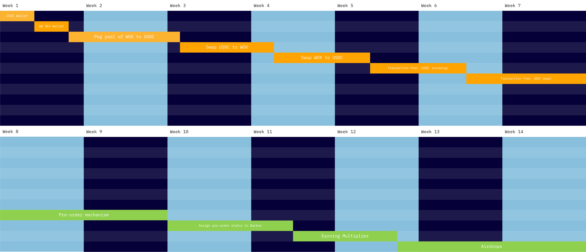
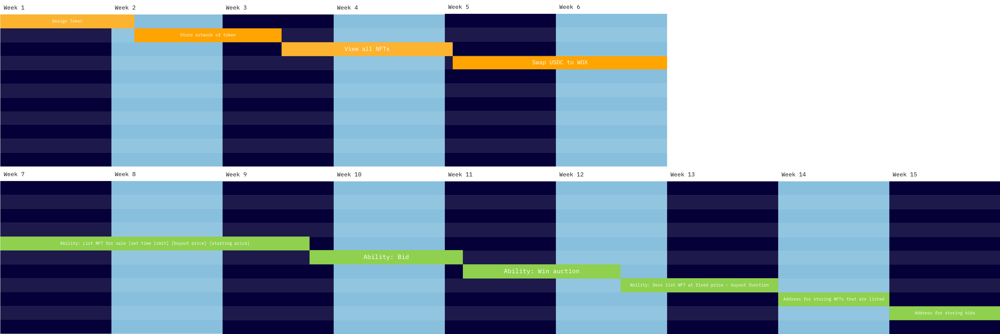

# Bepro Network Grant Proposal

* **Project Name:** WorldBox.tv
* **Team Name:** WorldBox.tv
* **Payment Address:** 0x98ff0CD86B39Cf1f505372DBa30292e7E8024511 (MetaMask ETH Mainnet)

### Overview

* Audience Driven, Interactive TV.
* Broadcast entertainment which uses viewer input to shape the way a show evolves in realtime. Long term goal of using user interaction to train an Artificial Neural Network (ANN) to create it's own unique narratives, thus creating unique experiences, on demand, on a per viewer basis.
* WorldBox will use the Bepro base code to build the projects token, dex, market and associated NFTs which will drive and reward viewer interaction.
* The WorldBox team is interested in this project as it would be the first to create truly interactive media - the inevitable blurring of the line between gaming and movies where a viewer can go anywhere and do anything, within a basic narrative framework.

### Project Details

* WorldBox has been split into multiple, stand alone stages. This first stage will culminate in the broadcast of the first WorldBox Production, an interactive show streamed on the WorldBox App through which viewers will be able interact and earn production specific NFTs and WOX, the WorldBox token. All the blockchain aspects of this foundation stage (token, market, NFT factory etc.) will be built on the Bepro base code.
* While the WorldBox App will have a traditional UI for menus etc. the interactive aspects will be created on a per production basis i.e. each interactive scene will have a custom built responsive overlay through which viewers will be able to provide input. The first WorldBox production 'Loop' will be live footage, but future production may be built from pre-rendered animation, with the final goal being to use a game engine to render scenes in real time. 
* Due to the highly complex nature of our final goal of creating 'completely interactive' media we have purposely simplified the interactive elements of the project for the first production so we can focus on perfecting the base mechanics i.e. gathering a massive amount of user input and executing it within a live broadcast. In essence, the API in initial productions can be defined as a 'crowd funded narrative'.
* Our technology stack for this initial stage will consist of an App based front end. All calculations of viewer score, allocation of crypto rewards, NFTs etc. as well as the hosting and streaming of content will obviously be handled on the server side.
* Due to the large scope of the project, especially in terms of verticle and horizontal scalability, we are running an ongoing scoping exercise which will determine exactly which core components, protocols, architecture, etc. will be deployed. Since this will be a task paid for by WorldBox, some of these aspects (such as final hosting solutions) will only be determind once we start developing the primary elements of the app, which will come after we have completed the block chian aspects of the project.
* The WorldBox system was initially developed as a completely analog system of physical sets (as in film sets) and a pen and paper D&D style show, with live actors playing multiple roles and having several costume changes. While Jono Heaney (the projects creator) still hopes to put on a performance like this, he admits it would be a vanity project with a unfeasible budget. The well developed documentation for this flavour of the WorldBox project is available on request.
* Listing the limitations of the project is an interesting subject as when you fully understand what the end goal of WorldBox is, there is very little the system could not be retasked to do. Leading with this has proven to be a sure way of seeding doubt due to the sheer magnitude of the projects scope, as such, we have started to excluded it almost completely from the marketing and investment material. In short: Once we have developed a system that can accurately replicate the nuances of humour, love, hate, satire etc. within the human frame of reference, it could be set to simulate any manner of tasks in a billion different ways, thus finding the most efficient way of completing them, and given the correct interface, perform them better than a human ever could.

### Ecosystem Fit

* In it's initial stages WorldBox will form a bridge between Interactive Games, Passive Broadcast Media, NFT collectibles and Personal wealth.
* We will be using NFTs with built in atributes as a way to personalise and manage individual viewer experiences.
* We are looking to bring the massive global audience typically associated with Passive Media into the realm of Interactive Games.
* WorldBox will provide entertainment for the masses, who will in turn provide the backpropagation needed to train the WorldBox ANN.
* As yet there are no similar projects within the Bepro or other networks that we are aware of.

## Team :busts_in_silhouette:

### Team members

* Team Leader (WorldBox.TV, Suspended Animation) Jonathan Heaney 
* App and Code Development (Touch Foundry) Fabio Longano 
* Film Production (9mm Films) Peter Heaney
* Sound Design (One Nation Studios) Greg Canning

### Contact

* **Contact Name:** Johathan Michael Heaney
* **Contact Email:** jono@worldbox.tv
* **Website:** www.worldbox.tv

### Legal Structure

* **Registered Address:** TBD (We have held back on registering an entity until we have concluded investment negotiations).
* **Registered Legal Entity:** As above.

### Team's Location

* **Place of Operations:** Johannesburg and Cape Town South Africa - Suspended Animation, 9mm Films, One Nation Studios, Touch Foundry.

### Team's experience

Suspended Animation - In business since 2003. Hundreds of TV projects both local and international. Full work history available on request. A broad cross section of work can be found in our showreels. https://vimeo.com/user3710422

Touch Foundry - In business since 2010. Massive worldwide footprint. Please see our website for details https://touchfoundry.co.za/our-story/

9mm films - In business since 2005. Hundreds of TV projects both local and international. Full work history available on request. Please checkout our Vimeo channel for a broad crosssection of our work https://vimeo.com/9mmfilms

One Nation Studios. In Business since 2012. Hundreds of TV projects both local and international. Please see out site for details of our extensive body of work. https://www.onenationstudios.co.za/

### Team Code Repos
To be completed by Touch Foundry team once we commence the coding part of the project.

* https://github.com/<your_organisation>
* https://github.com/<your_organisation>/<project_1>
* https://github.com/<your_organisation>/<project_2>

GitHub accounts of team members.

* TouchFoundry team - Since the cream of our code belongs to our clients the best place to see it in action is through our website showcase:
* https://touchfoundry.co.za/showcases/
* And our case studies which can be found here.
* https://touchfoundry.co.za/case-studies/

* To be completed by Touch Foundry team once we commence the coding part of the project.
* https://github.com/<team_member_1>
* https://github.com/<team_member_2>

### Team LinkedIn Profiles

* https://www.linkedin.com/in/jono-heaney-4913992/
* https://www.linkedin.com/in/fabiolongano/
* https://www.linkedin.com/in/peter-heaney-7506011a2/
* https://www.linkedin.com/in/gcanning/

## Development Status :open_book:
Not Applicable

## Development Roadmap :nut_and_bolt:

### Overview

* **Total Estimated Duration:** 2 years
* **Full-Time Equivalent (FTE):** To be updated as part of Milestone 2. We need to scope the project as a whole (app, film production and blockchain). Once this is complete we will be able to separate the blockchain elements from the rest and provide an accurate costing and FTE.
* **Total Costs:** As above (to be updated). Due to the broad scope of the project we will be utilising funds from several sources beyond the Bepro grant.

### Milestone 1 — Project structure development

* **Estimated duration:** 2017 - Q4 2021
* **FTE:**  NA
* **Costs:** NA (internal)

* WorldBox has been in development since 2017 and has been through 3 major re-development stages. It's final structure is now complete and forms our first and arguably one of our most important milestones. The internal documents detailing this final structure (production process, interactive advertising etc.) are available to Bepro on request.
* The other aspects of this milestone, which are already complete are:
* -Create project website.
* -Complete grant application (excluding final costings and coding details which are part of a much wider costing which are step 1 of the 2nd Milestone).

### Milestone 2 — Core Marketing and Token development

* **Estimated Duration:** 4 months
* **FTE:**  TBD
* **Costs:** TBD

* Scope technical aspects of project as a whole.
* Confirm budgets, FTE and timeframe for development.
* Update Bepro grant document.
* Create WorldBox BEP20 Token.
* Create User Data Service.
* Create explainer videos as well as associated marketing.
* Create Interactive Marketing package.

#### Development roadmap
> WorldBox BEP20 Token - Estimated development time - **40 Days**
> 
> Includes unit tests & documentation  
* Setting up of Repository / Project
* Create Contract
* Mint Token
* Burn Token
* Cross account authorization
* Snapshots
* Deploy contract

> User Data Service - Estimated development time - **30 Days**
>
> Includes unit tests & documentation
* Create DB Model that describes a user
* CRUD operations
* Ability: Add USDC
* Ability: Withdraw USDC
* Attribute: Owned USDC
* Attribute: Full Name
* Attribute: Email
* Attribute: Country

> Milestone 2 Gantt

### Milestone 3 — App design and Pre-Production process

* **Estimated Duration:** 3 months
* **FTE:**  TBD
* **Costs:** TBD

* Create WorldBox DEX - This will contain a single liquidity pool of USDC which can only be swapped for WOX tokens, which are held in various Prize Pool wallets (established for each production built on the system), as well as in user wallets. WOX tokens of a value equivalent to each USDC input are auto-minted and sent to the relevant wallet(s), with said USDC being inserted into the liquidity pool. The DEX needs to keep track of the total circulating supply of WOX tokens and calculate their value according to Total USDC in the liquidity pool. WOX tokens are burnt when swapped for USDC. Incoming transactions (i.e USDC into the pool) are charged a 3% fee, outgoing transactions (i.e. USDC out of pool) are charged 10%. Half of these fees, which are paid in WOX, are sent to the WorldBox Dev wallet, the other half are burned (i.e. removed from total circulating supply). @Luke This would include a page added to the WorldBox.tv website at a later. so please include.
* Hold Stage 1 ICO - Backers pre-purchase a limited quantity of WOX tokens which will only be minted and airdropped just before the 1st production goes live. Backers will also be airdropped rare Earning Multiplier NFTs according to their invested amount. (The capital raised from this Stage 1 ICO will be used to fund the pre-production of the first interactive show and develop interactive advertising packages for prospective advertisers. It will also fund elements of App development not covered by the Bepro grant. Funds raised may also be used to attach an A list actor to the project which would substantially increase its marketability.)

#### Development roadmap
> WorldBox DEX - Estimated development time - **40 Days**
>
> Includes unit tests & documentation
* Setup of USDC pool (Wallet)
* Setup of Worldbox DEV wallet
* Peg pool of WOX to USDC Pool
* Ability: Swap USDC for WOX (Mint)
* Ability: Swap WOX for USDC (Burn)
* Transaction fees (USDC deposit) 3%
* Transaction fees (WOX to withdraw) 10%

> Stage 1 ICO - Estimated development time - **35 Days**
>
> Includes unit tests & documentation
* Pre-order mechanism - represent a backer
* Backers to gain "Pre-order" status
* Attribute: Earning Multiplier
* Ability: Airdrops

> Milestone 3 Gantt

### Milestone 4 — Production Content Creation and App Intergtation. Testing.

* **Estimated Duration:** 3 months
* **FTE:**  TBD
* **Costs:** TBD

* Create WorldBox NFT Market. This will be a simple auction system where users can put the various WorldBox NFTs up for auction using WOX as the unit of trade. Only WorldBox Devs would have access to a ‘buy now’ function to sell promotional NFTs at a set price for various productions and promotions.
* Create NFT template which WorldBox devs can use to create the various NFTs for each production, taking into consideration that the attributes of these NFTs will need to be accessed en masse at the beginning of each episode to calculate various interaction and earning metrics. Artwork for each NFT will be a looping GIF based on content taken from its associated production.
* Hold Stage 2 ICO - Offering a limited quantity of Tokenized WorldBox profit shares in the form of a profit share NFT. Wallets which hold these NFTs when a snapshot is taken at the close of each broadcast season will receive a share of the WorldBox profits generated during that season from advertising, dex and market revenue. This stage 2 ICO will look to fully fund the first WorldBox production in terms of the typical production process i.e. filming and post production.

#### Development roadmap
> WorldBox NFT - Estimated development time - **35 Days**
>
> Includes unit tests & documentation
* Design Token attributes
* Store artwork of token
* Retrieve tokens en masse
* Ability: WB devs can create tokens using template

> NFT Market - Estimated development time - **40 Days**
>
> Includes unit tests & documentation
* Ability: List NFT for sale [set time limit] [buyout price] [starting price]
* Ability: Bid
* Ability: Win auction
* Ability: Devs list NFT at fixed price - buyout function
* Address for storing NFTs that are listed
* Address for storing bids

> Milestone 4 Gantt

### Milestone 5 — App design and implementation on Bepro testnet. Pre-Production process. Interactive Advertising test. Payment gateway testing.

* **Estimated Duration:** TBD
* **FTE:**  TBD
* **Costs:** TBD

* As above, this stage includes app and broadcast elements outside of the scope of Bepro base code and grant, but are included here to provide clarity due to how they interact with each other.
* Create the WorldBox App which integrates all the utilities developed in previous Milestone (i.e. Wallet, Dex and Market).
* Develop core UI and UX in terms of show interaction and video streaming. This will be done in template format to streamline the development and rollout of future interactive productions on the system.
* Standard web based profile creation which (once a profile has been verified) will be recorded to an NFT. Network fees relating to NFT creation TBD.
* Rollout app to Testnet
* Test basic app functions (Profile and associated NFT creation, wallet connection, NFT gallery, NFT Market and Dex).
* Test viewer interaction mechanisms (UI & UX.)
* Test broadcast system in terms of the user interaction driving video sequences in real time. This includes the collection and tabulation of mini-game results.
* Test calculation of viewer episode scores and awarding of WOX tokens incl. NFT modifiers.
* Test NFT Market. Simulate various economic conditions.
* Test Dex. (especially in terms of system security)
* Test Interactive Advertising Templates, Rollout and reward calculation and distribution.( See section below for more details)
* Integrate and test Visa/Master card function which allows users to buy WOX tokens directly through the app. The system would need to buy USDC externally, then mint and distribute WOX tokens to wallets accordingly.
* Creation of 6 mini-game templates (as per production development document) for integration into each production. @Luke the design of these will be provided from my end (graphics and mechanics) - for your end it would involve the coding and implementation in the app.
* Pre-production (interactive story structure, scripting, art design, casting, contracts etc.)
* Film and design low budget video sequence placeholders for system testing.
* Create example interactive advert for testing as well as marketing demo for advertisers. @Luke Design on my end - coding your side. Basically a template where e.g. A 15sec Coke advert (video) with 7 hidden coke bottles that users can click to get WOX rewards.
* Sign Interactive Advertising and Broadcast sponsors for first show.

### Milestone 6 — Production Content Creation and App Intergtation. Testing.

* **Estimated Duration:** 8-10 months
* **FTE:**  TBD
* **Costs:** TBD

* Filming and post production (Primary content creation for first broadcast.)
* Format and conform video content to WorldBox System, switch out low budget placeholders.
* Format content for mini-game creation. Finalise minigames and integrate.
* Format content (artwork) and create broadcast specific NFTs.
* Creation and rollout of marketing campaigns.
* Pressure test internal economy and associated elements (token, wallet, NFTs, dex, market, visa/master card facilities).
* Hold private ‘dress rehearsals’ i.e. test interactive and broadcast systems.
* Test legacy viewing element.
* Rollout to Mainnet.
* Fill liquidity pool with USDC from sponsors and advertisers.
* Release app to the public but with limited functionally (profile creation, wallet connection, direct WOX purchase).
* Airdrop WOX and NFTs to early backers.
* Airdrop NFTs won in promotions.
* Activate all functionality on the app.

* FIRST BROADCAST goes live.
* Viewers start to receive interaction rewards.
* First prize giving - Production#1 Prize pool distributed to top 10 viewers at the end of season 1.
* Gen 1 NFTs distributed to all viewers who complete the first production.
* Legacy viewing mechanisms activated in app for season 1.

## Future Plans

* WorldBox has been carefully segmented so as each portion of the project can stand alone as an appealing (in terms entertainment) and profitable business venture. Each subsequent stage is designed to fund the next, adding more interaction and collecting more user data (in terms of how humans like to experience a narrative.)
* From this point forward, with well established systems and templates in place, WorldBox will:
* - Develop and broadcast new shows on the system.
* - Develop new mini games and increasingly complex interactive elements.
* - Begin developing the data miner which collects audience input in such a way as to map out narrative patterns. With a working, profitable system in place we will be looking to partner up with companies who are working on Artificial Neural Networks, such as OpenAI.
* - Look to license the broadcast system to established shows (such as Survivor and The Bachelorette) which can be rejuvenated through the incorporation of audience input.
* - Look to license the content and app to major streaming platforms (such as Netflix) - Although we will be looking to make these agreements from a much earlier stage as part of our film production phase.

## Additional Information :heavy_plus_sign:

**How did you hear about the Grants Program?**  
* I initially left a message via the Bepro webform enquiring what the process would be to setup my own NFT gallery (due to being lost in the deluge of Open Sea - you can find my work here https://opensea.io/theMilitantBitCollective ) Filipe contacted me and through this interaction I learnt about the BUIDL initiative which I realised would be perfect to develop the blockchain aspect of my Interactive TV concept I had been working on for several years. 

Additional information relevant to this application but isn't part of it already:

Not Applicable at this point in time.
