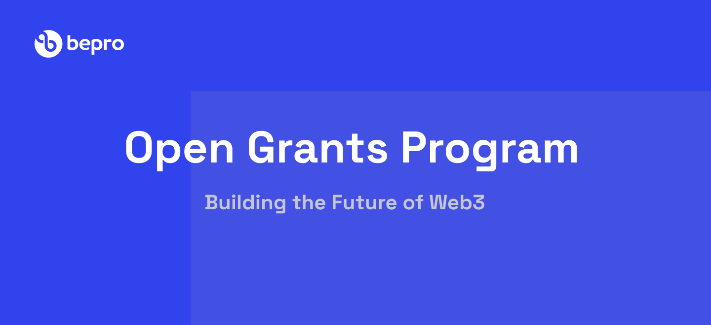

# BEPRO Grants Program

  

---

- [:wave: Introduction](#wave-introduction)
  - [Guidelines](#guidelines)
  - [Project ideas](#project-ideas)
  - [Support](#support)
  - [Team](#team)
- [:pencil: Process](#pencil-process)
- [:bulb: Help](#bulb-help)
  - [Additional information](#additional-information)
  - [Real-time conversation](#real-time-conversation)

## :wave: Introduction

As part of our commitment to promoting the bepro network developer/dapps ecosystem, we offer comprehensive grants programs focused on funding software development and research efforts related to **EVM Development Projects, Extension of Bepro-js capabilities or use of the Protocol to decentralize the development of open source projects** - this funding capital/treasury comes from the "Developer Boostrap" & "Ecosystem" portions, both in USDC & BEPRO value, +1,000,000€ to be deployed - the attributed amounts can go up to 2,500,000€.

### Guidelines

Anyone is welcome to apply for a grant. Projects funded through our programs are broad in scope, but our focus lies on strong **technical** projects that add value to the ecosystem.

Generally, your project will have better chances to get accepted if:

- It presents a **well-researched** or tested concept, for which ideally you are able to show some prior work.
- You can demonstrate that the project will be **maintained** after completion of the grant, be it through an obvious commitment to the technology from your side, additional funding sources or an existing business model.
- Your team has **proven experience** with the relevant languages and technologies and/or a strong technical background. We ask you to provide the GitHub profiles of all team members as part of your application and will examine these for past activity and code quality. Naturally, you can also link to projects on other platforms.
- Your application is **rich in technical details** and well-defined.
- You can clearly present how your project stands out among competitors or implements technology that doesn't exist in the ecosystem yet.

Additionally, it must fulfill the following requirements:

- All code produced as part of a grant must be **open-sourced**, and it must also not rely on closed-source software for full functionality. We prefer Apache 2.0, but GPLv3, MIT or Unlicense are also acceptable.
- We do not award grants for projects that have been the object of a successful token sale.
- As a general rule, teams are asked to finish a grant before applying for another one.
- Lastly, we do not fund projects that actively encourage gambling, illicit trade, money laundering or criminal activities in general.

In addition to the information provided on your application, note that your project will need to comply with our [Guidelines for Milestone Deliverables](./src/milestone-deliverables-guidelines.md). In particular, we require all projects to create documentation that explains how their project works. At a minimum, _written_ documentation is required for funding. Tutorials or videos are also helpful for new users to understand how to use your product. 

Finally, we take licensing and the right of all teams in and outside the ecosystem to be recognised for their work very seriously. Using others' work with no attribution or indication that this was not your own work as part of a milestone delivery **will lead to immediate termination**. Please reach out to us before submitting if you have any doubts on how to comply with a specific license and we'll be happy to help.

### Project ideas

Finally, you don't need to start your own project in order to be elligible for a grant. Instead, yoou can contribute to an existing open-source project as bepro-js. In the latter case, you should check in advance that the maintainers of the project are interested in your contribution, and the acceptance of the milestones will generally be tied to the inclusion of your work in said project.

If you have a **good concept of the technical challenges** that your idea entails and would like feedback before applying, you can send us an [email](mailto:general@bepro.network) and tell us about it.

### Support

The scope of our Grants Programs consists of funding and feedback on delivered milestones. This means that we do not provide hands-on support as part of a grant, but if you face specific issues during development, we will do our best and try to direct you to the correct resources. If this sounds like something you would like however, and we encourage you to join the [community](https://discord.gg/fM6ZEfED) in the #dev channels in order to get help with specific issues or to stay up to date with the most recent developments.

For questions about the grants program itself, see our [FAQ](./src/faq.md#frequently-asked-questions).

### Team

#### Grants Development Committee <!-- omit in toc -->

The committee consists of individuals who know the funding priorities of the Bepro ecosystem, and is responsible for evaluating grant applications and providing feedback on these.

- [Rui Pedro](https://github.com/ruiub3i)
- [Joao Gonçalves](https://github.com/moshmage)
- [Filipe Pinho](https://github.com/filipe-bepro)
- [Andre Moniz](https://github.com/andremoniz)
- [Justin Wu](https://github.com/thewujustin)

## :pencil: Process

> **:loudspeaker:** The process below allows for grants of up to **25K EUR per application**. Payment is made in BEPRO or stable currencies.

1. **Application**
   1. [Fork](https://github.com/bepronetwork/grants-program/fork) this repository.
   2. In the newly created fork, create a copy of the application template ([`applications/application-template.md`](applications/application-template.md)). If you're using the GitHub web interface, Make sure you **do not modify the template file directly**.
   3. Name the new file after your project: `project_name.md`.
   4. Fill out the template with the details of your project. The more information you provide, the faster the review. To get an idea of what a strong application looks like. Naturally, if you're only applying for a smaller grant that only consists of, say, UI work, you don't need to provide as much detail.
   5. Once you're done, create a pull request. The pull request should only contain _one new file_—the Markdown file you created from the template.
   6. You will see a comment template that contains a checklist. You can leave it as is and tick the checkboxes once the pull request has been created. Please read through these items and check all of them.
   7. Add the comment "I accept the [Terms & Services](https://github.com/bepronetwork/grants-program/blob/main/T%26Cs.md)" in the Pull Request as shown [here](https://github.com/bepronetwork/grants-program/pull/1)

2. **Application Review**
   1. The [committee](#grants-committee) can (and usually does) issue comments and request changes on the pull request.
   2. Clarifications and amendments made in the comments _need to be included in the application_. You may address feedback by directly modifying your application and leaving a comment once you're done. Generally, if you don't reply within 2 weeks, the application will be closed due to inactivity, but you're always free to reopen it as long as it hasn't been rejected.
   3. When all requested changes are addressed and the terms and conditions have been signed, someone will mark your application as `ready for review` and share it internally with the rest of the committee.
   4. The application will be accepted and merged as soon as it receives the approval of one third of the committee (currently 3 members), or closed after two weeks of inactivity. Unless specified otherwise, the day on which it is accepted will be considered the starting date of the project, and will be used to estimate delivery dates.

3. **Milestone Delivery and Payment**
   1. Milestones are to be delivered on the [Grant Milestone Delivery](https://github.com/bepronetwork/grants-program/milestones/) repository. You can find the delivery process [here](https://github.com/bepronetwork/grants-program/blob/main/milestones/intro.md).

The grant application can be amended at any time. However, this _necessitates a reevaluation by the committee_. If your application has been accepted and, during development, you find that your project significantly deviates from the original specification, please open a new pull request that modifies the existing application.

Additionally, we try to enforce the [code of conduct](CODE_OF_CONDUCT.md)

## :bulb: Help

### Additional information

| [Website](https://bepro.network) | [Twitter](https://twitter.com/bepronet) | [Medium](https://medium.com/bepronetwork) 

### Real-time conversation

We have Element channels for real-time discussions on Bepro-js and general questions. Join the conversation.

- [Telegram](https://t.me/betprotocol)
- [Discord](https://discord.gg/fM6ZEfED)

## :information_source: License <!-- omit in toc -->

[Apache License 2.0](LICENSE) © Bepro Network

## Importante Note & Credit Attribution

The Readme and Grants Repository structure was created based on https://github.com/w3f/Grants-Program as we see it as a great framework for the goal we want to achieve - we are not related in any way with the Web3 Foundation.

## Terms & Conditions

BEPRO Network Grants, BEPRO Protocol and BEPRO Token (BEPRO) are not available in Excluded Jurisdictions that can be found in our [terms and conditions](T&Cs.md)
